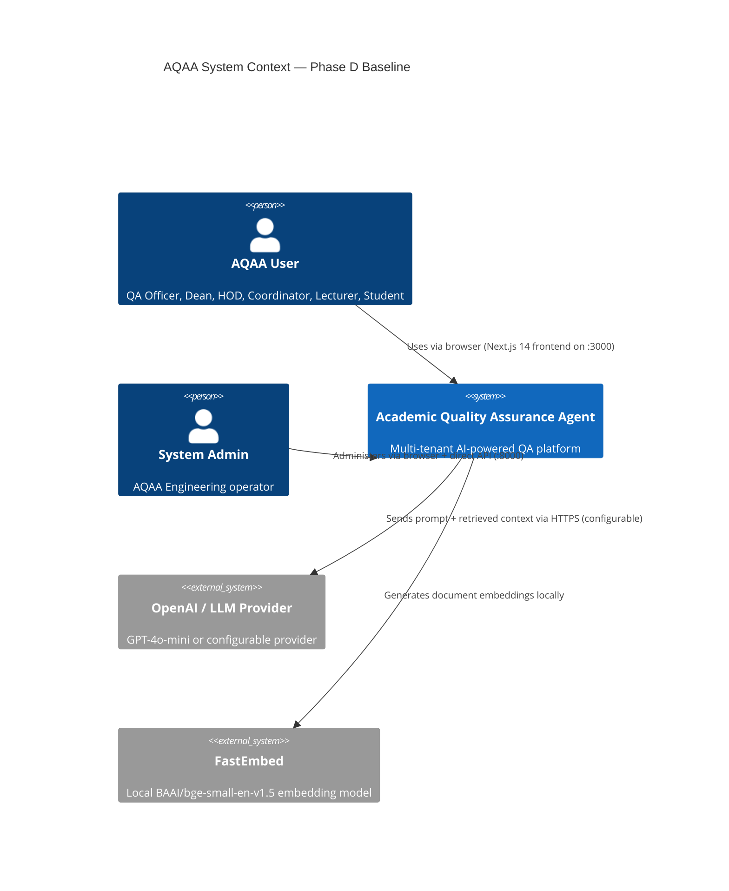
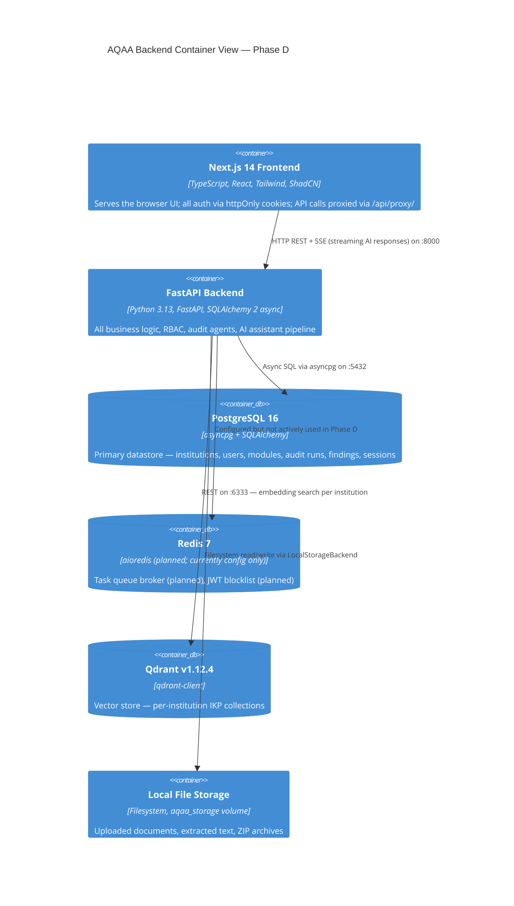
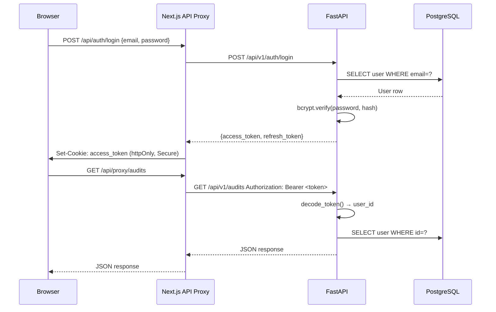
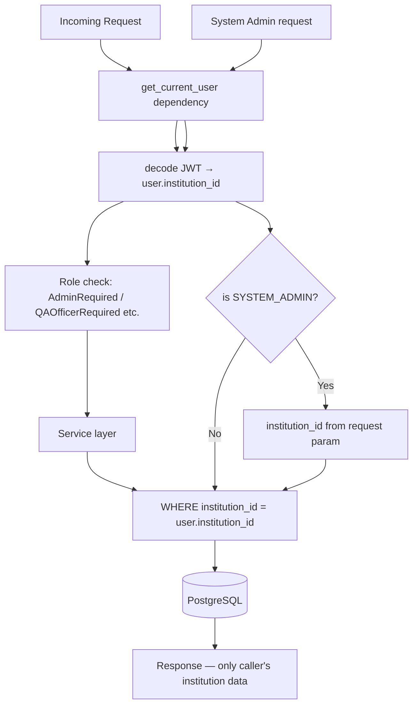
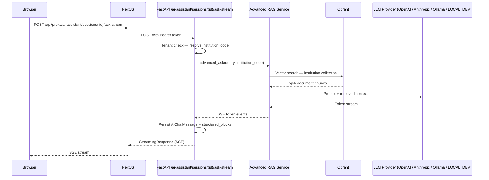
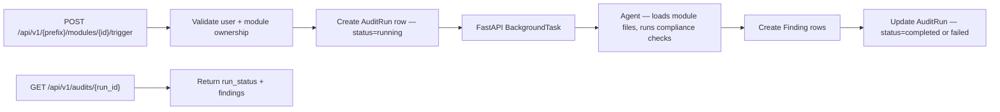
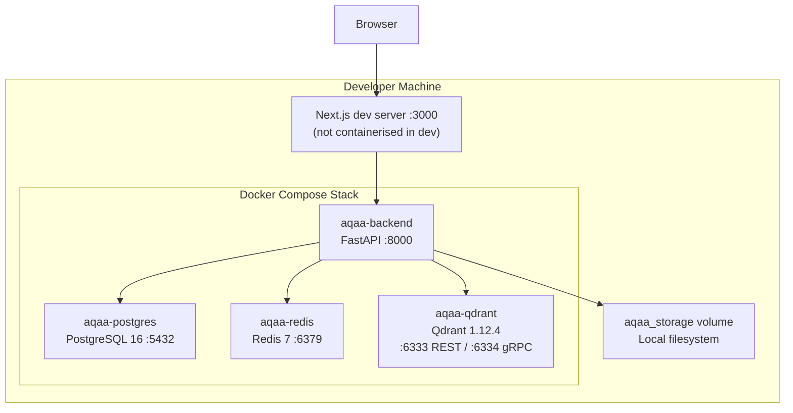

# AQAA Sprint E0 — Current-State Architecture Baseline

**Date:** 2026-07-20
**Branch:** `feature/phase-e-sprint-e0`
**Scope:** Phase D verified implementation — no Phase E features included.
**Prepared by:** AQAA Engineering — Principal Software Architect

> All claims in this document are grounded in direct file inspection. File references are in the form `path:line`. Planned Phase E services are explicitly excluded.

---

## 1. System Context



---

## 2. Backend Container View



---

## 3. Backend Module Map

Verified from `backend/app/` directory inspection.

### 3.1 Application Layers

| Layer | Location | Description |
|-------|----------|-------------|
| App factory + CORS + exception handlers | `backend/app/main.py` | `create_app()` builds FastAPI instance, registers middleware, mounts all routers |
| Configuration | `backend/app/config.py` | Pydantic `Settings` loaded from `backend/.env`; 50+ env vars |
| Authentication security | `backend/app/security.py` | bcrypt password hashing, HS256 JWT encode/decode |
| Dependencies / RBAC | `backend/app/dependencies.py` | `get_current_user`, named role shortcuts (`AdminRequired`, `QAOfficerRequired`, etc.) |
| Database session | `backend/app/database.py` | SQLAlchemy async engine + session factory + `get_db` dependency |

### 3.2 Route Modules (43 router files)

| Router | Prefix | Key responsibility |
|--------|--------|-------------------|
| `auth.py` | `/auth` | Login, refresh, profile |
| `institutions.py` | `/institutions` | Multi-tenant institution CRUD |
| `faculties.py`, `departments.py`, `modules.py`, `programmes.py` | Hierarchy | Five-level institution hierarchy |
| `audits.py` | `/audits` | Audit run lifecycle, report retrieval |
| `assessment_audits.py`, `moderation_audits.py`, `attendance_audits.py`, `evidence_audits.py`, `outcome_alignment_audits.py`, `accreditation_readiness_audits.py`, `programme_review_audits.py` | `/assessment-audits` etc. | 7 module-level and 1 programme-level AI audit agent triggers |
| `files.py` | `/files` | File upload, scan, categorisation |
| `ai_assistant.py` | `/ai-assistant` | AI QA Assistant: stateless ask, streaming sessions, attachment grounding |
| `artifacts.py` | `/artifacts` | Phase D artifact engine |
| `workspace.py` | `/workspace` | Session-level workspace context |
| `workflow.py` | `/workflow` | Audit workflow state machine |
| `findings.py` | `/findings` | Finding CRUD and status lifecycle |
| `notifications.py`, `comments.py`, `approvals.py` | — | Notification delivery, comments, approval chains |
| `regulatory_authorities.py`, `quality_frameworks.py`, `framework_assessments.py` | — | Regulatory framework engine |
| `knowledge_index.py`, `knowledge_review.py`, `institution_knowledge.py`, `ikp.py` | — | IKP knowledge indexing and search |
| `acquisition.py`, `extraction.py` | — | Web acquisition and document extraction |
| `dashboard.py`, `reporting.py`, `admin.py`, `providers.py` | — | Dashboard, reports, admin, AI provider config |

### 3.3 Agent Modules

Eight AI audit agents in `backend/app/agents/`:

| Agent | File | Scope |
|-------|------|-------|
| Module Folder Audit | `module_folder_audit.py` | module |
| Assessment Compliance | `assessment_compliance.py` | module |
| Moderation Compliance | `moderation_compliance.py` | module |
| Attendance Compliance | `attendance_compliance.py` | module |
| Evidence Verification | `evidence_verification.py` | module |
| Outcome Alignment | `outcome_alignment.py` | module |
| Accreditation Readiness | `accreditation_readiness.py` | module |
| Programme Review | `programme_review.py` | programme |

All agents trigger via `POST /api/v1/{prefix}/modules/{id}/trigger`, return HTTP 202 with `run_id`, and execute as FastAPI BackgroundTasks (in-process, no queue, no retry, no persistence across restarts).

---

## 4. Data Model

Verified from `backend/app/models/` directory (46 model files).

### 4.1 Institutional Hierarchy

```
Institution → Faculty → Department → Programme → Module
```

All models inherit `Base`, `UUIDPrimaryKeyMixin`, `TimestampMixin` from `backend/app/models/base.py`.

`Faculty.__tablename__ = "faculties"` (explicit — `backend/app/models/faculty.py`).

### 4.2 Tenant Isolation

- Every entity carries `institution_id: UUID` as a foreign key (verified in institution.py, faculty.py, department.py, programme.py, module.py, user.py).
- `Institution.is_demo: bool` — existing field at `backend/app/models/institution.py:41` — used to classify demo/test tenant.
- No `is_internal_test` field exists or is planned.

### 4.3 Key Enums

All defined in `backend/app/models/enums.py` as `str` enums.

| Enum | Values | Notes |
|------|--------|-------|
| `UserRole` | 7 values | SYSTEM_ADMIN, QA_OFFICER, FACULTY_DEAN, HOD, PROGRAMME_COORDINATOR, LECTURER, STUDENT |
| `NotificationType` | 10 values | AUDIT_ASSIGNED, DUE_SOON, OVERDUE, EVIDENCE_UPLOADED, EVIDENCE_MISSING, AUDIT_RETURNED, AUDIT_APPROVED, AUDIT_REJECTED, AUDIT_COMPLETED, NEW_COMMENT |
| `AuditRunStatus` | — | completed, failed, running, pending |
| `FindingStatus` | — | Full lifecycle including remediation states |
| `UploadState` | — | pending, scanning, ready, quarantined, failed |
| `SourceStatus` | — | OFFICIAL_VERIFIED, INSTITUTIONAL_APPROVED, TEST_FIXTURE, DRAFT_IMPORT, SUPERSEDED, ARCHIVED |

### 4.4 Alembic Migrations

21 migration files in `backend/alembic/versions/`. Head: `7602e7b39d25` (`phase_d_artifacts_actions_session_`). Verified 2026-07-20.

---

## 5. Authentication Flow



- Tokens are HS256 JWTs signed with `SECRET_KEY` (`backend/app/security.py`).
- Access token: 60 minutes. Refresh token: 7 days (`backend/app/config.py`).
- JavaScript never touches the token — stored in httpOnly cookie by the Next.js proxy.
- No JWT blocklist implemented in Phase D (Redis configured but not used for this).

---

## 6. Tenant Isolation Flow



Cross-institution reads return 404 (not 403) to avoid leaking resource existence (`backend/app/routes/` — consistent pattern across institution_id scoped routes).

Qdrant isolation: `backend/app/knowledge_indexing/qdrant_service.py` — one collection per institution-year-version. Cross-institution reads prevented at `search_service.py` by asserting institution_code matches caller's institution.

---

## 7. AI Request Flow



Attachment grounding: `backend/app/routes/ai_assistant.py` lines 550–628 — computes `attachment_grounding_status` per-request in the route handler and returns it in the SSE response JSON. This is NOT a persisted field on `AiChatMessage`.

---

## 8. Audit Agent Pipeline (Phase D)



**Phase D limitation:** BackgroundTasks are in-process only. If the backend container restarts during a long audit, the task is lost with no retry or recovery mechanism. This is the primary Phase E gap addressed by ADR-0009.

---

## 9. Current Deployment Topology



**No reverse proxy.** Direct HTTP access on localhost. No TLS. No Caddy or nginx service in `docker-compose.yml`. No observability sidecar (no Prometheus, no Loki, no Sentry agent).

---

## 10. Existing Operational Controls

| Control | Status | Evidence |
|---------|--------|---------|
| JWT authentication (HS256) | OPERATIONAL | `backend/app/security.py` |
| bcrypt password hashing (12 rounds) | OPERATIONAL | `backend/app/security.py:hash_password` |
| 7-tier RBAC with cumulative hierarchy | OPERATIONAL | `backend/app/dependencies.py` |
| institution_id tenant filtering | OPERATIONAL | All service-layer queries |
| Qdrant per-institution collection isolation | OPERATIONAL | `backend/app/knowledge_indexing/qdrant_service.py` |
| CORS: localhost:3000 only | OPERATIONAL | `backend/app/main.py` + `config.py:87` |
| File upload size limit (50 MB) | OPERATIONAL | `backend/app/config.py:MAX_UPLOAD_SIZE_MB` |
| ZIP path-traversal protection | OPERATIONAL | `backend/app/services/zip_upload_service.py` |
| ZIP max-member limit (500) | OPERATIONAL | `backend/app/services/zip_upload_service.py:_MAX_MEMBERS` |
| Domain exception → HTTP mapping | OPERATIONAL | `backend/app/main.py` exception handlers |
| httpOnly cookie token storage | OPERATIONAL | Next.js API proxy routes |
| JavaScript-inaccessible tokens | OPERATIONAL | Token never returned to browser JS |
| Server-side route protection | OPERATIONAL | `frontend/src/middleware.ts` |
| Role guard (client-side) | OPERATIONAL | `frontend/src/components/auth/RoleGuard.tsx` |
| Virus scan hook (disabled) | CONFIGURED BUT DISABLED | `backend/app/config.py:VIRUS_SCAN_ENABLED=False` |

---

## 11. Known Technical Debt

| ID | Description | Severity | Phase E remediation |
|----|-------------|----------|-------------------|
| TD-01 | No structured logging — only Python `logging` with unstructured output | HIGH | ADR-0011 (structlog + Prometheus) |
| TD-02 | No request correlation IDs | HIGH | E1 backlog item E1-OPS-001 |
| TD-03 | No rate limiting middleware | HIGH | E1 backlog item E1-SEC-002 |
| TD-04 | No security headers (X-Frame-Options, CSP, HSTS, X-Content-Type-Options) | HIGH | E1 backlog item E1-SEC-003 |
| TD-05 | No TLS — all traffic is HTTP | CRITICAL | ADR-0015 (Caddy) |
| TD-06 | Secrets in `.env` file — no Docker secrets, no vault | HIGH | ADR-0010 |
| TD-07 | No JWT revocation / blocklist (Redis configured but unused for this) | MEDIUM | E1 backlog |
| TD-08 | FastAPI BackgroundTasks — no retry, no persistence, no dead-letter | HIGH | ADR-0009 (ARQ) |
| TD-09 | PDF export is a placeholder stub | MEDIUM | ADR-0012 (WeasyPrint, Sprint E3) |
| TD-10 | No frontend test framework installed | HIGH | E0-OD-008 decision |
| TD-11 | No backup scripts or restore validation | HIGH | E1 backlog |
| TD-12 | Virus scanning disabled (`VIRUS_SCAN_ENABLED=False`) | MEDIUM | E1 backlog |
| TD-13 | No health check for Redis or storage backend | MEDIUM | E1 backlog |
| TD-14 | Email service in console mode if SMTP unconfigured | LOW | E1 backlog |
| TD-15 | 13 test files fail to collect (import errors) | MEDIUM | E0-ISS-002 / E1 investigation |

---

## 12. Missing Phase E Foundations

| Foundation | Status | Required by |
|------------|--------|-------------|
| Background task queue (ARQ) | MISSING | Sprint E0/E1 — ADR-0009 |
| Secrets management (Docker secrets) | MISSING | Sprint E1 — ADR-0010 |
| Structured logging + correlation IDs | MISSING | Sprint E1 — ADR-0011 |
| Prometheus metrics endpoint | MISSING | Sprint E1 — ADR-0011 |
| TLS / reverse proxy (Caddy) | MISSING | Sprint E1 — ADR-0015 |
| Security headers middleware | MISSING | Sprint E1 |
| Rate limiting middleware | MISSING | Sprint E1 |
| JWT blocklist (Redis) | MISSING | Sprint E1 |
| Corrective action tables | MISSING | Sprint E1 — M-E-01 |
| AI audit logging tables | MISSING | Sprint E2 — M-E-02 |
| Hallucination tracking | MISSING | Sprint E2 |
| Regulatory document registry | MISSING | Sprint E2 — M-E-03 |
| Compliance trend snapshots | MISSING | Sprint E3 — M-E-04 |
| PDF export (real implementation) | PLACEHOLDER | Sprint E3 — ADR-0012 |
| Pilot consent tracking | MISSING | Sprint E5 — M-E-05 |
| Background job + scheduler tables | MISSING | Sprint E0/E1 — M-E-00 |
| Autonomous audit scheduling | MISSING | Sprint E2 |
| Frontend test coverage | MISSING | Sprint E1 — E0-OD-008 |
| Backup + restore scripts | MISSING | Sprint E1 |

---

*Prepared by: AQAA Engineering — Principal Software Architect*
*Date: 2026-07-20*
*Verification basis: Direct file inspection of HEAD commit `3853b3a`*
