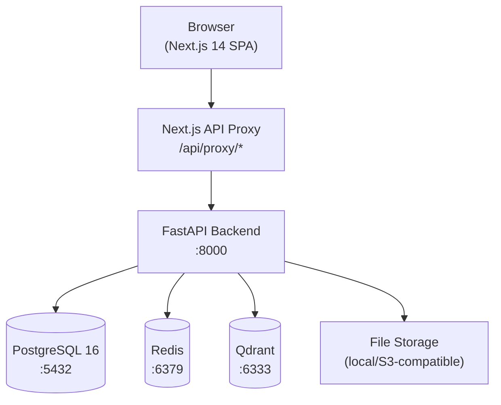

# AQAA Phase D — As-Built Architecture

**Phase D · AI-Native Operating System Transformation**
**Date:** 2026-07-17
**Commit:** `5b6e211756a71f27294c9f50dd2a6bfa6217a6e2`

---

## System Overview

AQAA is a standalone enterprise-grade Academic Quality Assurance platform. It provides an AI-native workspace where QA Officers, Lecturers, Coordinators, Deans, and Administrators interact with institutional knowledge through natural language, triggering AI audit agents, managing findings, and producing regulatory compliance evidence.



---

## Product Surfaces

| Surface | Route | Status |
|---------|-------|--------|
| AI Workspace | `/ai-workspace` | ✅ Live |
| Dashboard | `/dashboard` | ✅ Live |
| Library | `/library` | ✅ Live |
| Knowledge | `/knowledge` | ✅ Live |
| Audit Centre | via AI Workspace / API | ✅ Live |
| Findings | via AI Workspace / API | ✅ Live |
| Artifacts | Right panel in AI Workspace | ✅ Live |
| Conversation history | Session sidebar | ✅ Live |
| Administration | via role-scoped API | ✅ Live |

---

## Frontend Architecture

| Concern | Technology | Detail |
|---------|-----------|--------|
| Framework | Next.js 14.2.35 | App Router |
| UI library | React 18 | |
| Language | TypeScript 5 | Strict mode, 0 errors |
| Component library | ShadCN UI (`@base-ui/react`) | No Radix UI; no `asChild` |
| Styling | Tailwind CSS | JIT |
| State management | Zustand | Auth store |
| Server state | TanStack Query | Session hydration |
| Auth | httpOnly JWT cookies | JS never sees tokens |
| API proxy | Next.js Route Handlers `/api/proxy/{path}` | Reads cookie server-side |
| Route protection | `src/middleware.ts` | Redirects to `/login` if no cookie |
| Role guard | `RoleGuard.tsx` + `useRole.ts` | Renders by role |
| SSE streaming | `EventSource` via `fetch` + `ReadableStream` | Custom hook `useAiAssistant.ts` |
| Attachment upload | `multipart/form-data` via proxy | Module context required |
| Artifact rendering | `ArtifactPanel.tsx` | JSON + MD export |
| Session restoration | `GET /sessions/{id}` on open | Full message + artifact hydration |

---

## Backend Architecture

| Concern | Technology | Detail |
|---------|-----------|--------|
| Framework | FastAPI 0.136.3 | Async, ASGI |
| Language | Python 3.13 | |
| ORM | SQLAlchemy 2 (async) | `asyncpg` driver |
| Auth | JWT HS256 | 60min access / 7d refresh |
| RBAC | Cumulative role hierarchy | 7 levels |
| Tenant isolation | `institution_id` FK + query filters | All entity types |
| Conversation service | `ai_chat_sessions` + `ai_chat_messages` | SSE streaming |
| Artifact service | `ai_artifacts` + `ai_actions` | CRUD + archive/restore |
| Findings service | `audit_findings` + `finding_status_history` | 8-state machine |
| Audit service | 8 AI audit agents | Background tasks |
| Document processing | Parsers: PDF, DOCX, TXT, CSV, ZIP | Factory pattern |
| Semantic retrieval | Qdrant + `sentence-transformers` | all-MiniLM-L6-v2, 384-dim |
| Regulatory engine | `regulatory_authorities` + `quality_frameworks` | Source-status aware |
| Orchestration registry | `orchestration_registry.py` | Intent → action dispatch |
| Request planner | `request_planner.py` | Intent detection, confirmation gate |
| Context resolver | `context_engine.py` | Module/programme from query |

---

## Data Layer

| Store | Technology | Purpose |
|-------|-----------|---------|
| Primary DB | PostgreSQL 16.14 | All relational data, 58 tables |
| Cache | Redis | Session cache, rate limiting |
| Vector store | Qdrant 1.x | Semantic retrieval, 384-dim Cosine |
| File storage | Local filesystem (`STORAGE_BACKEND=local`) | Uploaded files |
| Embedding provider | `sentence-transformers` | `all-MiniLM-L6-v2` |
| Vector dimensions | 384 | |

### Qdrant Collections

| Collection | Institution | Points | Dimensions | Distance |
|-----------|------------|--------|-----------|---------|
| `tut_2026_v1_1_0` | TUT | 196 | 384 | Cosine |
| `up_2026_v1_0_0` | UP | 28 | 384 | Cosine |

---

## RBAC Hierarchy

```
SYSTEM_ADMIN
  → QUALITY_ASSURANCE_OFFICER
    → FACULTY_DEAN
      → HEAD_OF_DEPARTMENT
        → PROGRAMME_COORDINATOR
          → LECTURER
            → STUDENT (blocked from QA operations)
```

Permissions are cumulative. Each role inherits from all lower roles.

---

## Deployment

| Service | Image | Port | Volume |
|---------|-------|------|--------|
| aqaa-backend | Custom Dockerfile | 8000 | `./backend:/app` |
| aqaa-postgres | `postgres:16-alpine` | 5432 | `aqaa_postgres_data` |
| aqaa-redis | `redis:7-alpine` | 6379 | `aqaa_redis_data` |
| aqaa-qdrant | `qdrant/qdrant` | 6333, 6334 | `aqaa_qdrant_data` |

---

## Key Architectural Constraints

1. JWT tokens live only in httpOnly cookies — JavaScript cannot access them
2. All API calls from browser go through Next.js proxy — backend never receives direct browser requests
3. `module_id` must be set before file attachment — enforced in UI and backend
4. Cross-tenant access: sessions return 403, module/programme return 404
5. Student role cannot access any QA Workspace operations
6. All regulatory citations include `source_status` — no auto-equivalence between frameworks
7. ZIP extractions skip executables, paths with traversal, and symlinks
8. Attachment grounding uses a 6-stage pipeline with structured failure reporting
