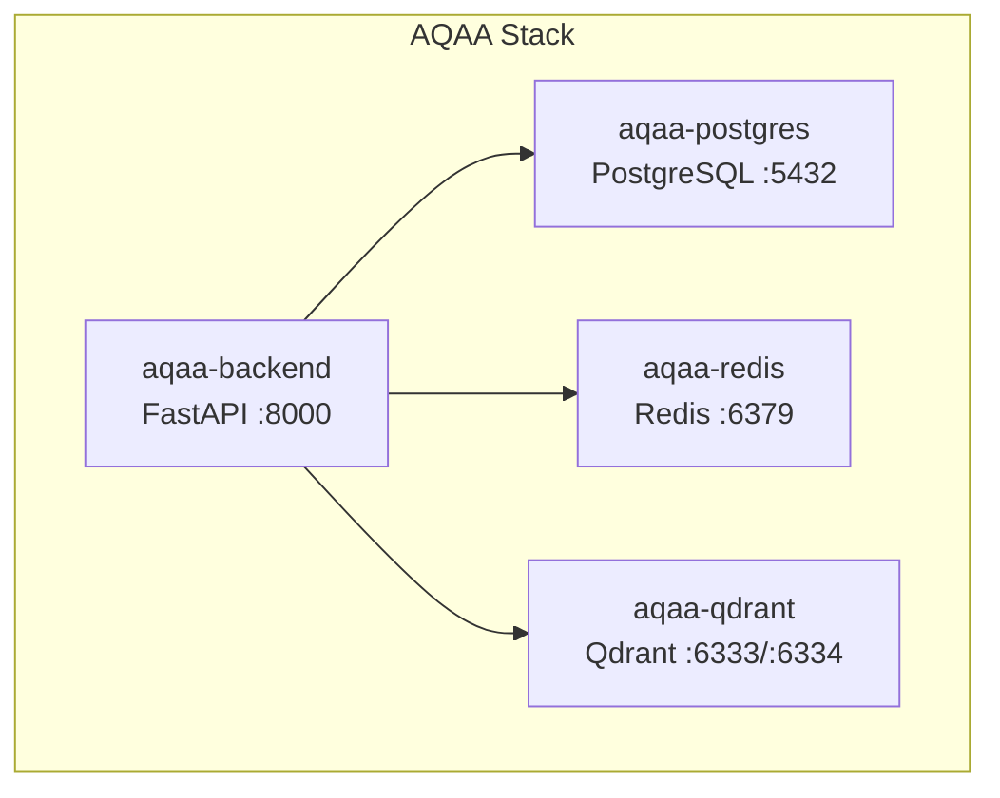

# AQAA Phase D — Deployment Snapshot

**Date:** 2026-07-17

---

## Docker Services



---

## Service Definitions

### aqaa-backend

| Property | Value |
|----------|-------|
| Image | Custom (Dockerfile in `backend/`) |
| Port | `8000:8000` |
| Volume | `./backend:/app` (source mount) |
| Health check | `GET /health` → 200 |
| Depends on | postgres, redis, qdrant |
| Environment | `DATABASE_URL`, `REDIS_URL`, `QDRANT_URL`, `SECRET_KEY`, `STORAGE_BACKEND` |
| Startup | `uvicorn app.main:app --host 0.0.0.0 --port 8000` |
| Reload | NOT used in Docker (`--reload` only for local dev) |

### aqaa-postgres

| Property | Value |
|----------|-------|
| Image | `postgres:16-alpine` |
| Port | `5432:5432` |
| Volume | `aqaa_postgres_data` (named volume, persistent) |
| Health check | `pg_isready` |
| Database | `aqaa` |
| User | `aqaa` |

### aqaa-redis

| Property | Value |
|----------|-------|
| Image | `redis:7-alpine` |
| Port | `6379:6379` |
| Volume | `aqaa_redis_data` (named volume, persistent) |
| Health check | `redis-cli ping` |

### aqaa-qdrant

| Property | Value |
|----------|-------|
| Image | `qdrant/qdrant` |
| Ports | `6333:6333` (REST), `6334:6334` (gRPC) |
| Volume | `aqaa_qdrant_data` (named volume, persistent) |
| Health check | `bash -c '</dev/tcp/localhost/6333'` |

---

## Startup Order

```
postgres (healthy) → redis (healthy) → qdrant (healthy) → backend (healthy)
```

---

## Persistent Volumes

| Volume | Service | Purpose |
|--------|---------|---------|
| `aqaa_postgres_data` | postgres | All relational data |
| `aqaa_redis_data` | redis | Persistent cache / session data |
| `aqaa_qdrant_data` | qdrant | Vector index data |

---

## Common Commands

```bash
# Start all services
docker compose up -d

# Start datastores only
docker compose up -d postgres redis qdrant

# Stop (data persists)
docker compose down

# Stop and wipe all data
docker compose down -v

# Restart backend after code changes
docker compose restart backend

# View logs
docker compose logs -f backend
docker compose logs -f postgres

# Check health
docker compose ps
```

---

## Environment Configuration

See `docs/releases/phase-d/AQAA_PHASE_D_ENVIRONMENT_VARIABLES.md` for full variable list.

Key variables:

| Variable | Used by | Purpose |
|----------|---------|---------|
| `DATABASE_URL` | Backend | PostgreSQL connection |
| `REDIS_URL` | Backend | Redis connection |
| `QDRANT_URL` | Backend | Qdrant REST endpoint |
| `SECRET_KEY` | Backend | JWT signing key |
| `STORAGE_BACKEND` | Backend | `local` or `s3` |
| `CORS_ORIGINS` | Backend | Allowed origins |
| `NEXT_PUBLIC_API_BASE_URL` | Frontend | Backend URL for proxy |

---

## Verified Status (2026-07-17)

```
NAMES           STATUS                    PORTS
aqaa-backend    Up (healthy)   0.0.0.0:8000->8000/tcp
aqaa-postgres   Up (healthy)   0.0.0.0:5432->5432/tcp
aqaa-redis      Up (healthy)   0.0.0.0:6379->6379/tcp
aqaa-qdrant     Up (healthy)   0.0.0.0:6333-6334->6333-6334/tcp
```
