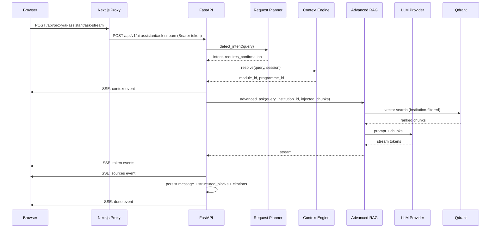
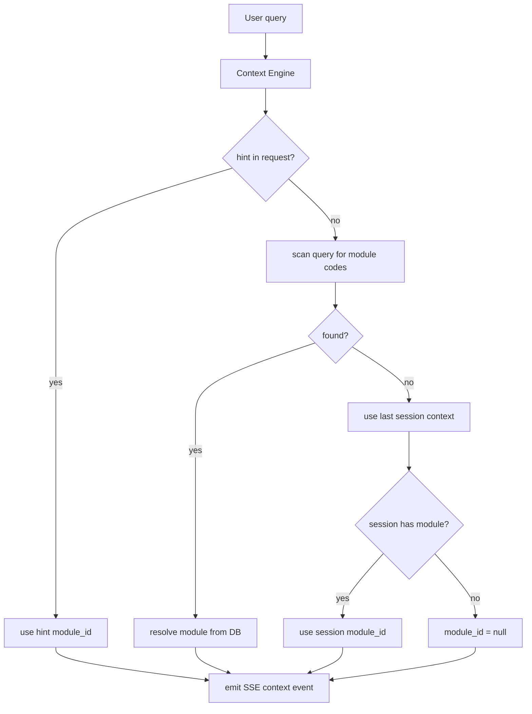
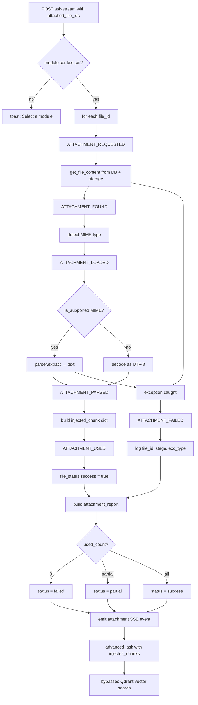
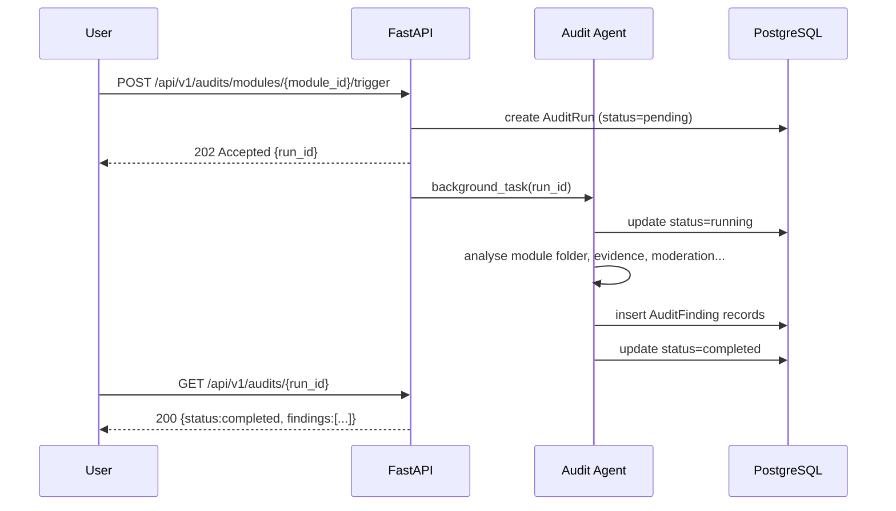
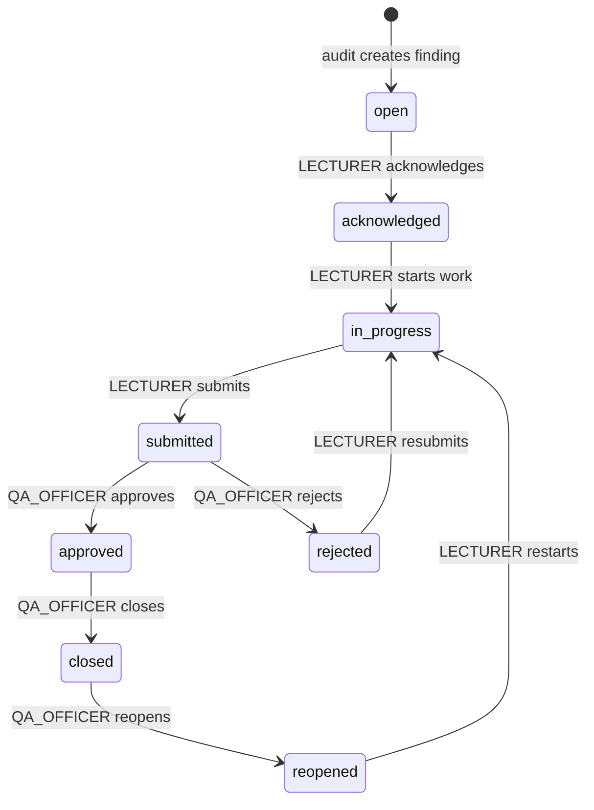
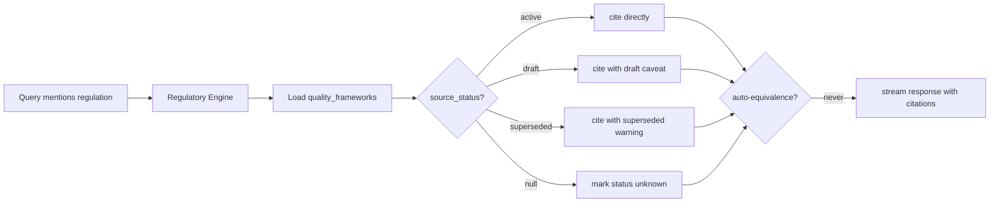
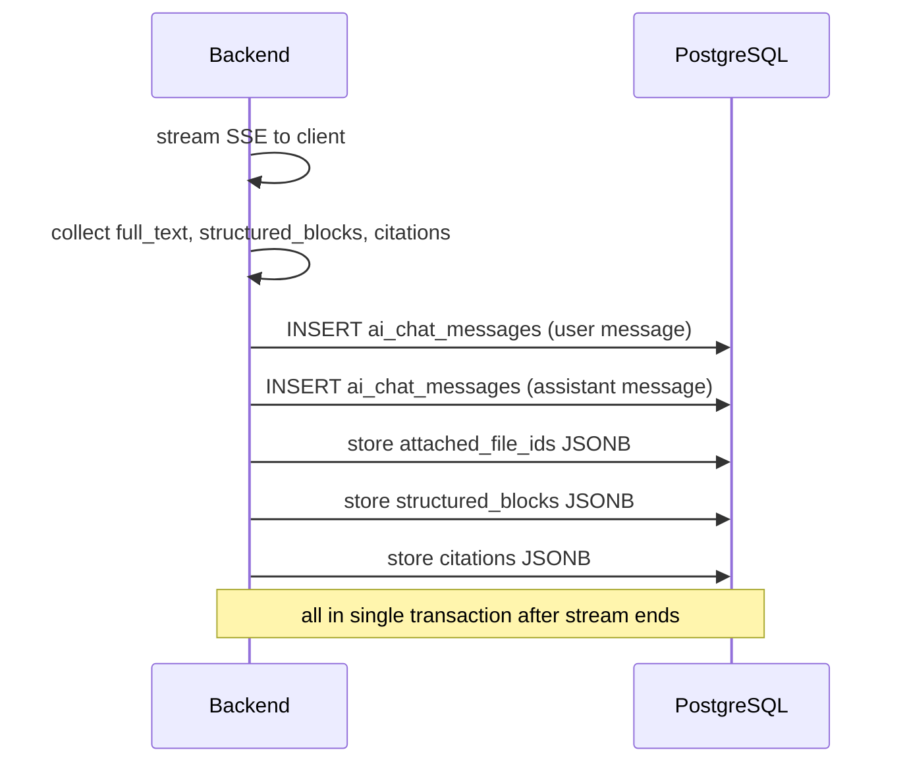
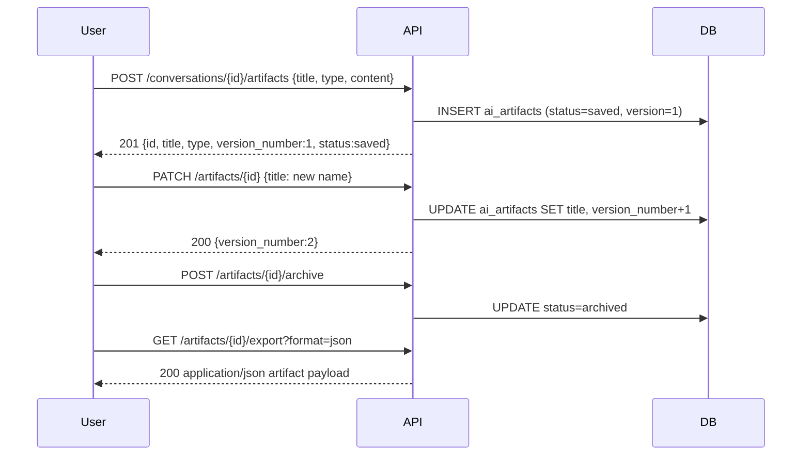
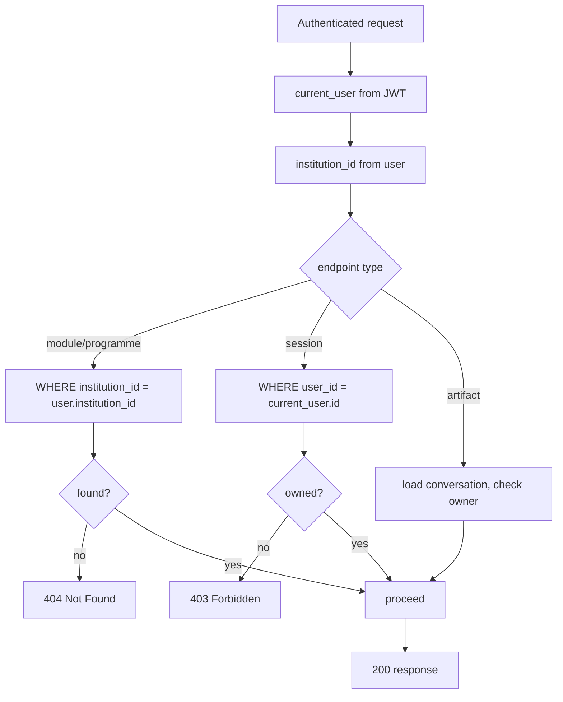

# AQAA Phase D — Runtime Flow Map

**Date:** 2026-07-17

---

## 1. Natural-Language Request Flow



---

## 2. Context-Resolution Flow



---

## 3. Attachment-Grounding Flow



---

## 4. Module-Audit Flow



---

## 5. Findings Lifecycle Flow



---

## 6. Regulatory-Readiness Flow



---

## 7. Conversation-Persistence Flow



---

## 8. Artifact-Generation Flow



---

## 9. Citation-Generation Flow

```mermaid
flowchart TD
    Chunks[ranked_chunks from RAG] --> Map[map to source dicts]
    Map --> Fields[entity_type, entity_id, entity_key, title, text,\nsource_document, confidence_score,\nrelevance_score, institution_id]
    Fields --> SSE[emit sources SSE event]
    SSE --> Persist[store in ai_chat_messages.citations JSONB]
    Persist --> Restore[available on GET /sessions/{id}]
```

---

## 10. Tenant-Isolation Enforcement Flow


